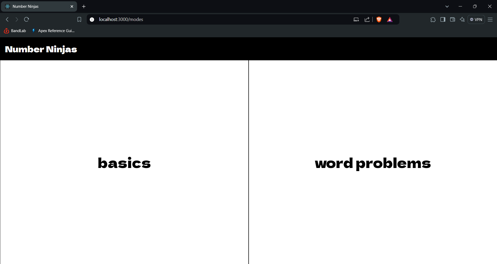
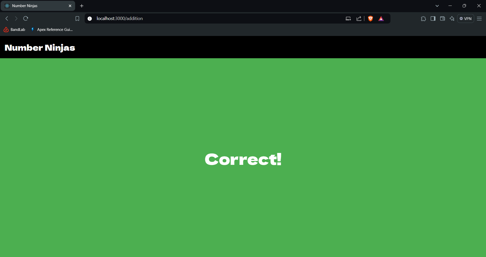

## Number Ninjas (math-web-app)

**Project Overview**: This is a web-based math quiz app to help students practice and improve their math skills. It offers a variety of math problems, including addition, subtraction, multiplication, division, comparison. Also there are word problems that are generated using GenAI (Google Gemini). The app features user-friendly interfaces for both students and teachers (Under Development).

**Project Scope**: Developed for a single school/organization

**Student Interface**: The student simply has to enter their name, roll number, standard/grade and divison/class. If the record for the student is found in the database then the student can access the app. The student can choose which topic to practice. Word problems are generic and do not mention the type.

**Teacher Interface(Under Development)**: The teacher will be responsible for registering the students. The teacher will be able to see the progress of the children in various forms. They can also send a report about the same to the guardians of the children.

**Future Plans**:

* **Integration with Salesforce**:
Integrating the app (tecaher interface) with Salesforce to streamline data management and communication.

**Tech Stack**: 
* For student interface - MERN, GenAI
* For teacher interface - Under Development

**Images**

* Student Interface

